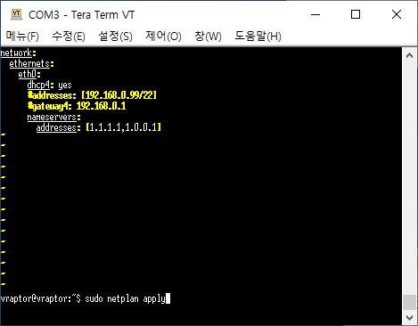

## Try to figure out 

1. Edit netplan conf. 
  - nameservers: cloudflare(just in my favor)
  - ref. [lesstif](https://www.lesstif.com/lpt/ubuntu-netplan-ip-static-ip-config-61899302.html)

```conf
# /etc/netplan/01-netcfg.yaml
network:
ethernets:
  eth0:
    dhcp4: yes
    #addresses: [192.168.0.99/22]
    #gateway4: 192.168.0.1
    nameservers:
      addresses: [1.1.1.1,1.0.0.1] # <- HERE
```


```bash
sudo netplan apply
```

2. About Nginx customed conf.
  - objective: migration to Traefik in microk8s
    - saved in [this repo](https://github.com/kkumtree/vraptor-xslab-pasonaru/tree/main/conf) 

## install(personal)

1. enable microk8s's Traefik
  - microk8s cluster enables LB services
  - [Existing blog post](https://www.virtualizationhowto.com/2022/12/microk8s-ingress-controller-configuration-with-traefik/) recommended to install MetalLB but, I wondered about LB provided with Traefik.
  
```bash
# traefik will be installed with helm chart
microk8s enable traefik
```

```shell
Traefik Ingress controller 20.8.0 has been installed. Next, you can start
creating Ingress resources to access your services. Useful commands:

1. Get the external IP of the LoadBalancer service.

    $ microk8s kubectl get service -n traefik traefik

2. If your cluster cannot provision LoadBalancer services, you can also use the NodePort service.

    $ microk8s kubectl get service -n traefik traefik-ingress-service

3. Access the Traefik Web UI at http://localhost:18080

    $ microk8s kubectl port-forward -n traefik traefik-web-ui 18080:8080
```

```bash
microk8s kubectl get service -n traefik traefik
```

```shell
NAME      TYPE           CLUSTER-IP      EXTERNAL-IP   PORT(S)                      AGE
traefik   LoadBalancer   10.152.183.28   <pending>     80:31913/TCP,443:32495/TCP   9m28s
```
